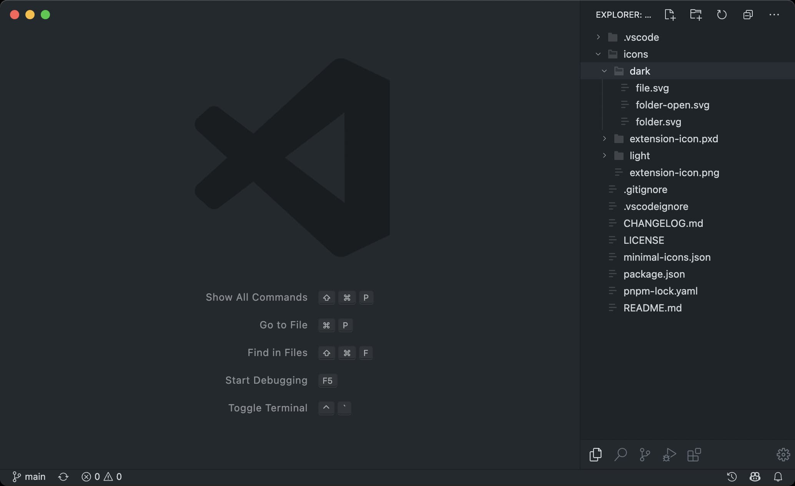

# minimal-icons

A minimal icon theme for VS Code - all file types share the same minimal file icon.

## Installation

Install the `jacobwgillespie.minimal-icons` extension from the Marketplace:

👉 [`jacobwgillespie.minimal-icons` on the VS Code Marketplace](https://marketplace.visualstudio.com/items?itemName=jacobwgillespie.minimal-icons)

## Credits

Folder and file icons from the [Quill Icons extension](https://github.com/cdonohue/vscode-quill-icons).

## License

MIT license, see `LICENSE`.
